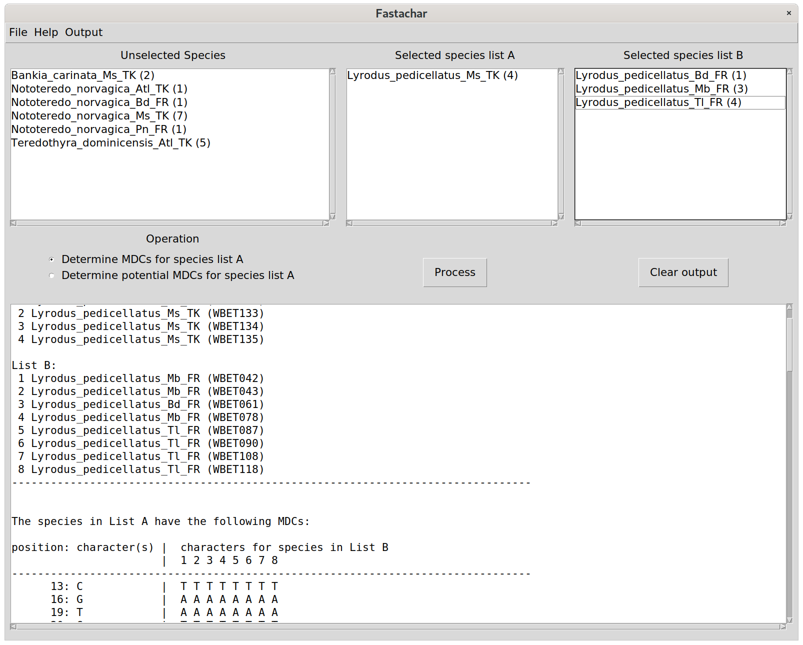
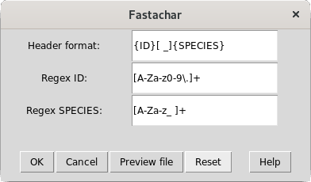

What is Fastachar for and how to use it?
========================================

**Fastachar** is a graphical user interface to the **fastachar** python module
that allows a user to compare pre-aligned DNA sequences. Sequences of different 
markers must be analysed individually (not concatenated). A typical application is to 
distinguish one species from a set of different, but closely related other species, 
based on DNA sequences.

Example
-------

Let's assume we have DNA sequences from specimens of cryptic species
(a pair or more). After the discovery of the new species it is
paramount to carry out the final step in taxonomy, their description.
However, in this case, the morphological characters *per se* cannot be
use to describe the new cryptic species. Therefore, molecular
diagnostic characters (present in all members of a taxon and absent in
all other taxa) can be obtained from the DNA sequences. These
characters can be used to describe a species in a similar fashion to
traditional morphological diagnostic characters used for species
descriptions. To that end, the algorithm compares two sets of
sequences, with one set consisting of a number of sequences of a taxon
(e.g., a new species) and the other consisting of sequences of other
taxa (e.g., conspecific or confamilial species). For each homologous
position in the alignment (pre-aligned sequences), the algorithm tests
for all characters of the sequence in the first set to be the same and
to be different from all other characters of the sequences in the
other set. When these conditions are met, the character in that
position (nucleotide or amino acid) is marked as a **molecular
diagnostic character**.

Preparation
-----------
The input for **fastachar** is a list of DNA sequences, formatted in the
fasta format (see also
https://en.wikipedia.org/wiki/FASTA_format). The program assumes that
the DNA sequences that are going to be compared are:

* already aligned, and
* written into a single file in fasta format.

There are several software programs to align sequences (e.g. Mega and Geneious).

Running **Fastachar**
---------------------

On Windows, **fastachar** is run by executing the fastachar.exe, and on
Linux, it is run by executing fastachar from the terminal
console. Once started, a new window appears with three empty text
boxes, labelled "Unselected species", "Selected species list A" and
"Selected species list B",
respectively. Below, there is a set of radio buttons to select the
comparison operation, a button to execute the comparison ("Process")
and a button ("Clear output") to clear the output that is generated
and shown in the bottom text box, see the Figure.

      
   Figure 1: Main window of **Fastachar**

   
Opening a fasta file
~~~~~~~~~~~~~~~~~~~~

To start working, a fasta file is opened using::
  
  File
   └── Open fasta file

and select a fasta file from the dialogue offered. If a valid fasta
file is read, the text box **Species** is populated with the names of
the species found.

Alternatively, a fasta file can be opened using::
  File
   └── Open fasta file /w preview

This allows the user to specify how the **fastachar** should interpret
the header strings that precedes each string of sequence data. When
opening a file with preview, first a pop-up window appears:

	   
   Figure 2: A pop-up window allowing to specify regular expressions for parsing
   the fasta header strings

   
+--------------+---------------+------------------------------------------------+
|              | Example       | Description                                    |
+==============+===============+================================================+
|Header format:|{ID} {SPECIES} | Ordering of id/lab code and species name       |
+--------------+---------------+------------------------------------------------+
|Regex ID:     |[A-Za-z0-9]+   | Regular expression matching the id string      | 
+--------------+---------------+------------------------------------------------+
|Regex SPECIES:|[A-Z][a-z ]+   | Regular expression matching the species string |
+--------------+---------------+------------------------------------------------+

The *Header format* describes how each header is structured and must
contain the strings {ID} and {SPECIES}. In the example given, the id
precedes the species name and a space separates the two strings. The
values for the entries *Regex ID* and *Regex SPECIES* are both regular
expressions and are substituted into the *Header format* for *{ID}%*
and *{SPECIES}*, respectively. See :ref:`regular_expressions` for more information on
regular expressions.

::
   >WBET001_Nototeredo_norvagica_Ms_TK
   TACTTTGTATTTTATTTTTTCTATTTGAGCGGGTTTGGT.....

When reading the fasta file, the format of the headers of each
sequence is ass
This procedure assumes that 

Selecting species for set  A and B
~~~~~~~~~~~~~~~~~~~~~~~~~~~~~~~~~~~~
Select a species name by left-clicking. A multiple selection can be
made by clicking again with **ctrl** pressed, which also selects the
item clicked. If instead of **ctrl** the **shift** key is pressed, all the
items in between are selected as well.

In order to move them into either set A or set B, drag the
selected items from the **Species** text box to the target text box
whilst holding the right-mouse button pressed.

Selecting the operation
~~~~~~~~~~~~~~~~~~~~~~~
Once the selection is made, the comparison operation is to be
selected. Two operations are implemented:

* show unique characters of one set
* show differences within a single set.

Either operation can be applied to set A or B.

After selecting the operation, the comparison can be executed by
clicking the **Process** button, and a report appears in the lower text
box.

Case files
~~~~~~~~~~
At this stage a case file can be written, which stores:

* the fasta file read
* the selection made
* the operation selected.

To save a case file select from the menu: ::

  File
   └── Save case file

To load a previously saved case file: ::
 
  File
   └── load case file

Output
~~~~~~

Multiple operations as well as species selections can be processed and
the output will be appended to the lowest text box. The output can be
cleared using the **Clear output** button.

To save the output to file, select from the menu: ::

  Output
   └── Save report (txt)

to write the output as show in a text file, or ::
  
  Output
   └── Save report (xls)

to write the output in an excel file, with a tab for each processing
operation.

Help
~~~~

The user interface also provides help and information on the licensing
from the menu entry::

  Output
   └── Help
  
and ::

  Output
   └── About

respectively.

