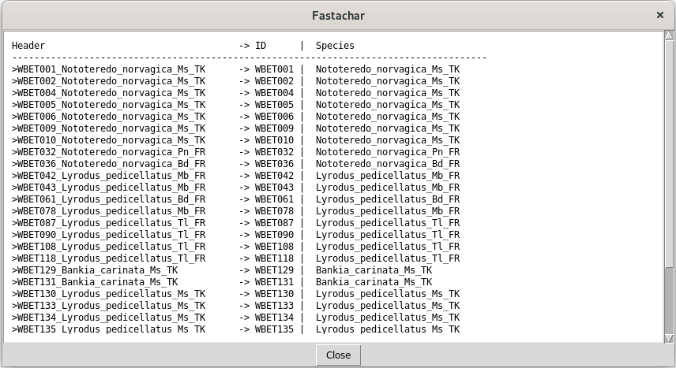

What is Fastachar for and how to use it?
========================================

**Fastachar** is a graphical user interface to the **fastachar** python module
that allows a user to compare pre-aligned DNA sequences. Sequences of different 
markers must be analysed individually (not concatenated). A typical application is to 
distinguish one species from a set of different, but closely related species, 
based on DNA sequences.

Example
-------

Let's assume we have DNA sequences from specimens of cryptic species
(a pair or more). After the discovery of the new species it is
paramount to carry out the final step in taxonomy, their description.
However, in this case, the morphological characters *per se* cannot be
used to describe the new cryptic species. Therefore, molecular
diagnostic characters (present in all members of a taxon and absent in
all other taxa) can be obtained from the DNA sequences. These
characters can be used to describe a species in a similar fashion to
traditional morphological diagnostic characters used for species
descriptions. To that end, the algorithm compares two sets of
sequences, with one set consisting of a number of sequences of a taxon
(e.g., a new species) and the other consisting of sequences of other
taxa (e.g., congeneric or confamilial species). For each homologous
position in the alignment (pre-aligned sequences), the algorithm tests
for all characters of the sequence in the first set to be the same and
to be different from all other characters of the sequences in the
other set. When these conditions are met, the character in that
position (nucleotide or amino acid) is marked as a *molecular
diagnostic character*.

Preparation
-----------
The input for *fastachar* is a list of DNA sequences, formatted in the
fasta format (see also
https://en.wikipedia.org/wiki/FASTA_format). The program assumes that
the DNA sequences that are going to be compared already:

* are aligned, and
* written into a single file in fasta format.

There are several software programs to align sequences (e.g. Mega and Geneious).

Running **Fastachar**
---------------------

On Windows, *fastachar* is run by executing the fastachar.exe, and on
Linux, it is run by executing fastachar from the terminal
console. Once started, a new window appears with three empty text
boxes, labelled "Unselected species", "Selected species list A" and
"Selected species list B",
respectively. Below, there is a set of radio buttons to select the
comparison operation, a button to execute the comparison ("Process")
and a button ("Clear output") to clear the output that is generated
and shown in the bottom text box, see the Figure.

.. figure:: _static/main_window.png
   :align: center
   :width: 630px
      
   Figure 1: Main window of *Fastachar*

   
Opening a fasta file
~~~~~~~~~~~~~~~~~~~~

To start working, a fasta file is opened using::
  
  File
   └── Open fasta file

and select a fasta file from the dialogue offered. If a valid fasta
file is read, the text box *Unselected species* is populated with the names of
the species found.

Alternatively, a fasta file can be opened using::

  File
   └── Open fasta file /w preview

This allows the user to specify how the *fastachar* should interpret
the header strings that precedes each string of sequence data. When
opening a file with preview, first a pop-up window appears, similar to
the one below

.. figure:: _static/regex.png
   :align: center
   :width: 275px
	   
   Figure 2: A pop-up window allowing to specify regular expressions for parsing
   the fasta header strings

This window provides the user with a way to specify how the header
strings are to be parsed. All three fields accept regular expressions,
see :ref:`regular_expressions` for more information on
regular expressions and a worked example.

* Header format::
    The **Header format** describes how each header is structured and must
    contain the strings {ID} and {SPECIES}. In the example given, the id
    precedes the species name and a space or an underscore separates the
    two strings.

* Regex ID::
    The value for the entry **Regex ID** is substituted for the string
    *{ID}* in the header format string. As this string should match any of
    the lab codes or IDs used in the fasta file headers, it will usually
    be a regular expresssion.

* Regex SPECIES::
    The value for the entry **Regex SPECIES** is substituted for the string
    *{SPECIES}* in the header format string. Also this string will usually
    be a regular expresssion.

After editing the regular expressions, the button *Cancel* cancels
the modification, whereas the button *OK* accepts them. The button
*Preview file* provides the user with a file chooser dialogue to select a fasta
file. After this selection, the file is opened, and parsed. Each
header is interpreted and how it fares is shown in a separate window:

	   
   Figure 3: Popup window showing the results of the header parsing.

In the example of Figure 3, we see in the left column (Header) the
string as it appears in the fasta file. In the middle column, the
parsed ID string is shown, and in the right column the species
name. If the parsing fails completely, dashes only are shown. If the
regular expressions do not match the format of the header strings,
erroneous results are displayed.

.. note:: If some how the program is not capable of parsing the strings
	  correctly, a work around would be to describe the header string as
	  *{SPECIES}{ID}*, leave the regex for the ID blank, and for the
	  SPECIES a regular expression *.+* is prescribed. FastaChar will now
	  ignore any id's and consider the header of each sequence as a
	  separate species.

Selecting species for lists A and B
~~~~~~~~~~~~~~~~~~~~~~~~~~~~~~~~~~~~
Select a species name by left-clicking. A multiple selection can be
made by clicking again with *ctrl* pressed, which also selects the
item clicked. If instead of *ctrl* the *shift* key is pressed, all the
items in between are selected as well.

In order to move them into either list A or list B, drag the
selected items from the *Unselected species* text box to the target text box
whilst holding the right-mouse button pressed.

Selecting the operation
~~~~~~~~~~~~~~~~~~~~~~~
Once the selection is made, the comparison operation is to be
selected. Two operations are implemented:

* Determining MDCs for species list A
* Determining potential MDCs for species list A

After selecting the operation, the operation is executed by
clicking the *Process* button, and a report appears in the lower text
box, see Figure 1.

The output lists the path of the input fasta file (not shown in Figure
1), the species' names and IDs of the sequences in list A, and
list B. If the species in list A have any molecular diagnostic
characters, then they are listed by their position, their value, and
the values of the sequences in list B for the same position. Note that
masked characters, if any, are left blank.

A molecular diagnostic character is the character at position
:math:`k` of the sequences in list A, for which holds that:

#) all characters in A are identical for this position, and
#) all characters in B for are different from those in A for this
   position.

For a potential diagnostic character, the second condition is met
only. For a precise definition, the user is referred to the
accompanying paper, see [Merckelbach2020]_.
      

Case files
~~~~~~~~~~
To facilitate repeated operations on a specific file, or storing the
specifics of a case for future reference, a so-called case file can be
used. When writing a case file via::

  File
   └── Save case file

the following information can be stored:

* the fasta file read
* the regular expressions used for reading  
* the selection made
* the operation selected.

A previously saved case file can then be loaded by ::
 
  File
   └── load case file

Output
~~~~~~

Multiple operations as well as species selections can be processed and
the output will be appended to the lowest text box. The output can be
cleared using the *Clear output* button.

To save the output to file, select from the menu: ::

  Output
   └── Save report (txt)

to write the output of the last operation as shown in a text file, or ::
  
  Output
   └── Save report (xls)

to write the output in an excel file, with a tab for each processing
operation.

Help
~~~~

The user interface also provides help and information on the licensing
from the menu entry::

  Output
   └── Help
  
and ::

  Output
   └── About

respectively.

